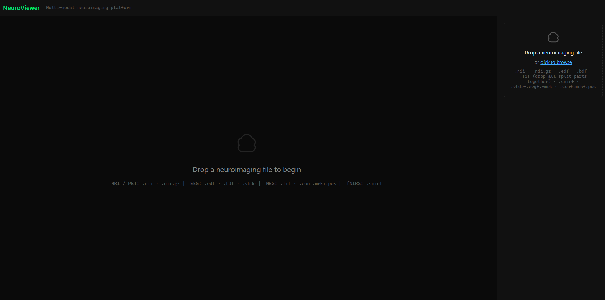
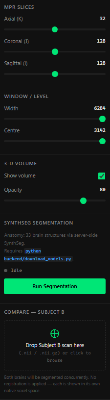
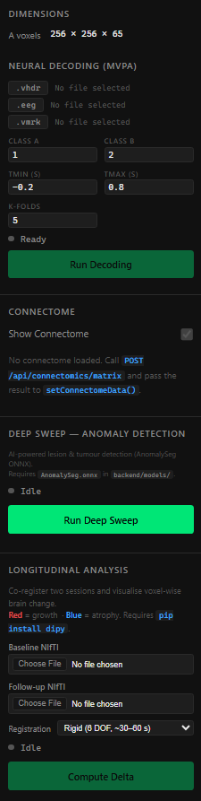

# NeuroViewer

A multi-modal neuroimaging platform for interactive visualisation and analysis of MRI, PET, EEG, MEG, and fNIRS data in the browser.

---

> **AI Disclosure**
> This project was developed with the assistance of [Claude](https://claude.ai) (Anthropic), an AI coding assistant.
> All architecture decisions, feature specifications, and implementation direction were provided by the author.
> Claude assisted with code generation, debugging, and documentation throughout the development process.

---

## Screenshots

<p align="center">
  
  <em>4-viewport MRI grid — axial, coronal, sagittal, and 3-D volume with SynthSeg segmentation overlay</em>
</p>

<br/>

<p align="center">
  
  &nbsp;
  
</p>

---

## Features

### MRI / PET Viewer
- **4-viewport grid** — axial, coronal, sagittal slices and interactive 3-D volume rendering side by side
- **MPR slice navigation** — independent K / J / I sliders per subject
- **Window / Level** — brightness and contrast control (width + centre)
- **3-D volume opacity** — continuous slider from transparent to fully opaque

### AI Brain Segmentation (SynthSeg)
- Runs server-side via a SynthSeg ONNX model — no GPU required on the client
- Segments **32 FreeSurfer brain structures** simultaneously
- **Tissue class toggles** — show or hide Grey Matter, White Matter, and CSF as groups
- **Per-structure anatomy selector** — individually toggle any of the 32 structures (e.g. Hippocampus L/R, Thalamus, Putamen, Cerebral Cortex, Lateral Ventricles …) with a real-time search filter and Show All / Hide All bulk actions
- **Hippocampal volumetrics** — left / right hippocampal volumes in cm³ with asymmetry index, displayed as a comparative bar chart against normative ±1 SD bands

### Split-Screen Comparison (Subject A vs B)
- Drag and drop a second NIfTI file onto the sidebar to open an instant **50 / 50 split view**
- **Concurrent segmentation** — SynthSeg runs on both subjects in parallel the moment Subject B is loaded
- Independent MPR slice and Window / Level controls per subject
- Independent anatomy selectors — toggle brain regions for Subject A and Subject B separately
- **Comparative volumetrics chart** — grouped bar chart comparing A-LH vs B-LH and A-RH vs B-RH
- Clear B button returns to the single-brain view

### SyN Registration (Dual Viewer)
- A dedicated **dual-viewer plugin** for inter-subject registration
- **Raw Overlay mode** — both brains displayed in their native voxel spaces; cameras are decoupled
- **SyN Alignment mode** — Subject B is warped into Subject A's space using Affine + SyN diffeomorphic registration (via dipy on the backend, ~2–5 min); cameras are locked so any rotation / zoom / pan is mirrored across both panes
- Warped actor cache — switching back to SyN mode after a raw detour is instant (no second API call)
- Spinner overlay on the right pane during registration; automatic rollback to raw mode on error
- **Anatomy selector for both panes** — structure visibility changes are applied to both the left (A) and right (B warped) overlay simultaneously

### EEG Viewer
- Loads **BrainVision format** (.vhdr + .eeg + .vmrk) via drag and drop
- Stacked waveform canvas with LTTB/MinMax decimation for fluid scrubbing
- Channel type tabs, amplitude scaling, and time window control
- Recording metadata display

### MEG Viewer
- Loads **Elekta/MEGIN TRIUX .fif** files via a FastAPI / MNE-Python backend
- Stacked waveform canvas with min/max envelope ribbons — streams decimated chunks on demand
- **Semantic channel colours** — magnetometers in sky-blue, planar gradiometers in green (replaces arbitrary rainbow palette)
- **Channel hover tooltip** — hover any channel label to see type (Magnetometer / Planar Gradiometer), physical unit, sensor pod number, and the sibling channels sharing that pod
- **Vertical scroll** — mouse-wheel or drag the scrollbar thumb to scroll through any number of selected channels; a proportional thumb appears automatically when lanes overflow the canvas
- **Band power mini-bars** — five 4 px bars (δ θ α β γ) rendered in each lane's label column using a client-side Hann-windowed DFT, giving an at-a-glance spectral fingerprint per channel
- **Spectral lane tint** — toggle "Tint: ON" in the controls sidebar to paint each lane's background with its sliding-window dominant frequency band colour (STFT, 75 % overlap); the colour transitions show exactly where one oscillation ends and the next begins
- **BIDS events overlay** — drag a `*_events.tsv` file onto the sidebar drop-zone to paint trial onset markers, duration shading, and trial-type labels directly on the waveform canvas
- **Artifact detection** — MNE EOG and muscle artifact spans highlighted in amber / grey
- **Spike detection** — 20 Hz high-pass filter + MAD thresholding; spike markers overlaid in red
- **Frequency band dashboard** — relative δ / θ / α / β / γ power as a horizontal bar chart (Welch PSD, server-side)
- **Topomap** — average magnetic field map over the current time window rendered in the sidebar
- **MEG source estimate** — minimum-norm inverse solution available via the backend

### Multi-modal Workspace
- Simultaneous **MEG waveform** (MegPanel) and **fMRI BOLD volume** (FmriPanel) in a split-panel layout
- Canvas click in the MEG panel writes `currentTimeSec` to a shared SyncContext; the fMRI pane snaps to the corresponding BOLD volume index
- A synced cursor line tracks the active time position across both panels
- MEG panel inherits all waveform features: vertical scroll, band power bars, spectral lane tint toggle, BIDS event markers

### fNIRS Viewer
- Loads **SNIRF v1.0** files via h5wasm (full HDF5 C library compiled to WASM)
- Supports SCALEOFFSET-compressed datasets

### General
- **BIDS path routing** — files are identified by BIDS-conformant path before falling back to extension matching
- **Web Worker parsing** — all NIfTI decompression and EDF/SNIRF parsing runs off the main thread; the UI stays responsive with large files
- **Dark radiological theme** — colour palette modelled on standard clinical workstation UIs
- Responsive split-panel layout with collapsible sidebar sections

---

## Tech Stack

| Layer | Technology |
|---|---|
| Framework | React 18 + TypeScript + Vite (rolldown bundler) |
| 3-D rendering | vtk.js v36 — MPR slices + volume ray-cast |
| Waveform canvas | Custom Canvas 2-D renderer (no charting library) |
| HDF5 / SNIRF | h5wasm v0.10.3 (WASM port of the HDF5 C library) |
| Backend | FastAPI + MNE-Python + dipy + onnxruntime |
| Segmentation model | SynthSeg ONNX (server-side inference) |
| Registration | dipy Affine + SyN diffeomorphic registration |

---

## Setup

### Frontend

```bash
npm install
npm run dev
```

The dev server starts at `http://localhost:5173`.

### Backend

```bash
pip install fastapi uvicorn mne nibabel scipy onnxruntime dipy

# Download the SynthSeg ONNX model (requires FreeSurfer or tf2onnx)
python backend/download_models.py

uvicorn backend.main:app --reload --port 8000
```

The frontend proxies `/api/*` requests to `http://localhost:8000`.

---

## Usage

### Loading a scan
Drag and drop any of the following file types onto the upload area:

| File type | Viewer |
|---|---|
| `.nii`, `.nii.gz` | MRI / PET grid viewer |
| `.vhdr` (+ `.eeg` + `.vmrk`) | EEG waveform viewer |
| `.fif` | MEG waveform viewer (Elekta/MEGIN TRIUX) |
| `.snirf` | fNIRS viewer |

### Running segmentation
1. Load a NIfTI file — the viewer opens in the 4-viewport grid.
2. In the sidebar, click **Run Segmentation**. The backend runs SynthSeg and returns 32 labelled structures as a coloured overlay.
3. Use the **Anatomy** panel to toggle individual structures on or off, search by name, or use **Show All / Hide All**.
4. Click **Compute Hippocampal Volumes** to measure left / right hippocampal volumes and display the normative comparison chart.

### Comparing two subjects
1. Load Subject A (NIfTI) — the 4-viewport grid opens.
2. In the sidebar, drag a second NIfTI onto the **Add Subject B** drop zone. The view splits 50 / 50 and segmentation runs concurrently on both.
3. Use the **Subject A — Anatomy** and **Subject B — Anatomy** panels to independently control the overlay for each brain.
4. Compute volumes for both subjects to see the **comparative bar chart**.

### SyN registration
1. Open the **Dual Viewer** plugin and load Subject A.
2. Select Subject B using the file picker in the sidebar — Subject B appears in the right pane in its native space (**Raw Overlay** mode).
3. Click the **SyN Alignment** toggle. The backend registers Subject B into Subject A's space. A spinner is shown on the right pane during processing (~2–5 min).
4. Once done, both panes share a locked camera — rotate or zoom on either side and the other follows.
5. Toggle back to **Raw Overlay** at any time. Switching back to SyN is instant (result is cached in memory).

---

## Project Structure

```
src/
├── plugins/
│   ├── volumetric/     # MRI/PET viewer + split-screen comparison
│   ├── dualViewer/     # SyN registration viewer
│   ├── eeg/            # EEG waveform viewer
│   ├── meg/            # MEG waveform viewer + scrollbar
│   ├── multimodal/     # MEG + fMRI split-panel workspace
│   └── nirs/           # fNIRS viewer
├── lib/
│   ├── vtk/            # vtk.js actor builders, segmentation overlay, LUT, fMRI BOLD renderer
│   └── meg/            # Client-side MEG signal processing
│       ├── channelColors.ts    # Type-based channel colours (mag/grad) + sensor pod parsing
│       ├── bandPower.ts        # Hann-windowed DFT, per-band power, colours and labels
│       └── laneSpectrogram.ts  # STFT sliding-window dominant-band analysis (BandSegment[])
├── contexts/           # SyncContext — shared time cursor for multimodal workspace
├── workers/            # Web Workers for NIfTI, EDF, SNIRF parsing
├── services/           # API clients (segment, SyN, MEG analysis, EEG, BIDS events)
├── components/         # Shared UI (AnatomySelector, ReferenceDrawer, FrequencyDashboard, MegTopomap …)
└── types/              # Shared TypeScript types

backend/
├── main.py                      # FastAPI app — all routers registered here
├── mri_analysis.py              # Hippocampal volumetrics router
├── meg_analysis.py              # Artifact detection, spike detection, frequency bands
├── routers/
│   ├── bids_events.py           # BIDS *_events.tsv parse endpoint
│   └── meg_source_estimate.py   # Minimum-norm MEG source estimate endpoint
└── download_models.py           # SynthSeg ONNX model download helper
```
